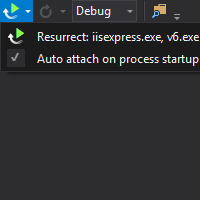

# Resurrect 

Visual Studio extension which attaches debugger to previously debugged processes. 

Download it from [Visual Studio Gallery](http://visualstudiogallery.msdn.microsoft.com/043c7c91-e127-4616-bce0-39b869cee4b3).

### <a id="license">License</a>

Copyright (c) 2014 Jarosław Waliszko

Licensed MIT: http://opensource.org/licenses/MIT
