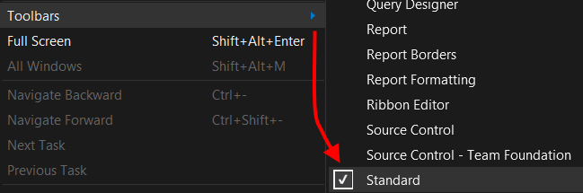
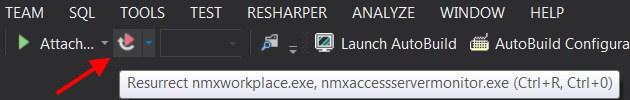

#Resurrect 

###What is it?

Visual Studio extension which resurrects debugging session with previously attached processes.

###How it works?

Attach operation is based on names of the processes. Previously chosen debugging engines are used as well. Processes to be re-attached are correlated with solutions to which they had been previously attached. Information about recently attached targets is almost immediately known across all Visual Studio instances opened at once. Resurrect uses system registry as a data storage. If you want the compiled artifact, grab it from [Visual Studio Gallery](http://visualstudiogallery.msdn.microsoft.com/043c7c91-e127-4616-bce0-39b869cee4b3).

###How to start using it?

* After installation it is accessible from standard toolbar (View -> Toolbars -> Standard) and under Ctrl + R, Ctrl + 0 (zero) shortcut:

 

* Fresh Visual Studio run after Resurrect installation will show its toolbar icon as disabled. It’s because there is no information stored yet about processes being debugged previously within current solution: 

 

* If you attach to some processes (Debug -> Attach to Process…) and next stop the debugging session, the plugin toolbar icon will became enabled:

 
